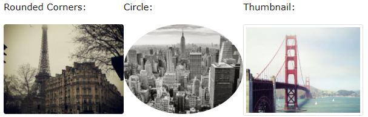

# Bootstrap 4

1. [Containers](#1. Containers)
2. [Grid System](#2. Grid System)
3. [Text / Typography](#3. Text / Typography)
4. [Colors](#4. Colors)
5. [Tables](#5. Tables)
6. [Images](#6. Images)
7. [Jumbotron](#7. Jumbotron)
8. [Alerts](#8. Alerts)
9. [Buttons](#9. Buttons)
10. [Button Groups](#10. Button Groups)
11. [Badges](#11. Badges)
12. [Progress Bar](#12. Progress Bar)
13. [Spinners](#13. Spinners)


## 1. Containers

`.container` **fixed** width container.

`.container-fluid` **full** width container.


>For `.container-fluid`, width is always 100%.
>
>For `.container`, depends of the viewport width:

| .container | ExtraSmall | Small | Medium | Large | ExtraLarge |
| ---------- | ---------- | ----- | ------ | ----- | ---------- |
| max-width  | 100%       | 540px | 720px  | 960px | 1140px     |


#### 1.1 Container Padding

By default, containers have 15px left and right padding, with no top or bottom padding. `.pt-1`, `.pt-2`, ..., `.pt-5` classes add extra padding and margin to make them look better. Example:

```html
<div class="container pt-3"></div>
```


#### 1.2 Container Border and Color

Other utilities than are also often used together with `.container` is: `border ` for borders, `bg-color` for backgrounds and `text-color` for the text. Examples:

```html
<div class="container p-3 my-3 border"></div>
<div class="container p-3 my-3 bg-dark text-white"></div>
<div class="container p-3 my-3 bg-primary text-white"></div>
```


#### 1.3 Responsive Containers

The `.container-sm` , `.container-md`, `.container-lg`, `.container-xl` classes create responsive containers, with adaptative **max-width** props.

|      Class      | < 576px | ≥ 576px | ≥ 768px | ≥ 992px | ≥ 1200px |
| :-------------: | :-----: | :-----: | :-----: | :-----: | :------: |
| `.container-sm` |  100%   |  540px  |  720px  |  960px  |  1140px  |
| `.container-md` |  100%   |  100%   |  720px  |  960px  |  1140px  |
| `.container-lg` |  100%   |  100%   |  100%   |  960px  |  1140px  |
| `.container-xl` |  100%   |  100%   |  100%   |  100%   |  1140px  |


## 2. Grid System

Bootstrap's grid sysyem is built with flexbox and allows up to 12 columns across the page. If you don't want to use all 12 columns individually, you can group them together to create wider columns.

The system is responsive, the columns will re-arrange automatically depending on the screen size. Make sure that the sum adds up to 12 or fewer (it is not required to use all 12 available columns).


#### 2.1 Grid Classes

The grid system has 5 classes than can be combined to create more dynamic and flexible layouts. 

| < 576px |  ≥ 576px   |  ≥ 768px   |  ≥ 992px   |  ≥ 1200px  |
| :-----: | :--------: | :--------: | :--------: | :--------: |
| `.col-` | `.col-sm-` | `.col-md-` | `.col-lg-` | `.col-xl-` |

> **Tip:** Each class scales up, so if you wish to set the same widths for `sm` and `md`, you only need to specify `sm`.


**Basic structure of a Bootstrap4 Grid**

```html
<!-- Control the column width, and how they should appear on different devices -->
<div class="row">
	<div class="col-*-*"></div>
  	<div class="col-*-*"></div>
</div>
<div class="row">
  	<div class="col-*-*"></div>
  	<div class="col-*-*"></div>
  	<div class="col-*-*"></div>
</div>

<!-- Or let Bootstrap automatically handle the layout -->
<div class="row">
  	<div class="col"></div>
  	<div class="col"></div>
  	<div class="col"></div>
</div>
```

**First example:** create a row (`<div class="row">`). Then, add the desired number of columns (tags with appropriate `.col-*-*` classes). The first star (\*) represents the responsiveness: **sm**, **md**, **lg** or **xl**, while the second star represents a number, which should add up to 12 for each row.

**Second example:** instead of adding a number to each `col`, let bootstrap handle the layout, to create equal width columns: 2 `col` = 50% width. 3 cols = 33.33% width. 4 cols = 25% width, etc. You can also use `.col-sm|md|lg|xl` to make the columns responsive.

Some examples:
```html
<!-- 3 columns with equal size -->
<div class="row">
    <div class="col">.col</div>
    <div class="col">.col</div>
    <div class="col">.col</div>
</div>

<!-- 4 columns, each one is 3/12 width. Cause it is 'col-sm', on mobile phones or screens less than 576px wide, the columns will stack vertically -->
<div class="row">
  	<div class="col-sm-3">.col-sm-3</div>
  	<div class="col-sm-3">.col-sm-3</div>
  	<div class="col-sm-3">.col-sm-3</div>
  	<div class="col-sm-3">.col-sm-3</div>
</div>

<!-- 2 colums, one 4/12 width and another 8/12 width. Stacked on movile size and scaling on larger screens -->
<div class="row">
	<div class="col-sm-4">.col-sm-4</div>
  	<div class="col-sm-8">.col-sm-8</div>
</div>
```


## 3. Text / Typography

B4 uses as default:

```css
text{
    font-size: 16px,
	line-height: 1.5,
	font-family: Helvetica Neue, Helvetica, Arial, sans-serif
}
p { margin-top: 0, margin-bottom: 1rem }
```


**Headings**: B4 also modifies the `<h1>` - `<h6>` headings with a bolder font and increased font-size.


**Display**: Display headings are used to stand out more than normal headings, with 4 classes to choose from: `.display-1`, `.display-2`, `.display-3`, `.display-4`.


**Small**: On B4, `<small>` element is used to create a lighter secondary text on any heading, like: 

```html
<h1>Main heading text <small>secondary text smaller</small> </h1>
```


**Abbr**: B4 styles `<abbr>` with a dotter border bottom.


**Blockquote**: Add `.blockquote` and `.blockquote-footer` when quoting:

```html
<blockquote class="blockquote">
    <p>Any random quote that anybody never said</p>
    <div class="blockquote-footer">Albert Einstein, 2025</div>
  </blockquote>
```


**Other elements**: B4 also styles some html elements like `<dl>`, `<code>`, `<kbd>` (useful for show keyboard shortcuts) and `<pre>`.  


**More typography classes**:

|          Class          | Description                                         |
| :---------------------: | --------------------------------------------------- |
|   `.font-weight-bold`   | Bold text                                           |
|  `.font-weight-bolder`  | Bolder text                                         |
|     `.font-italic`      | Italic text                                         |
|  `.font-weight-light`   | Light weight text                                   |
| `.font-weight-lighter`  | Lighter weight text                                 |
|  `.font-weight-normal`  | Normal text                                         |
|         `.lead`         | Makes a paragraph stand out                         |
|        `.small`         | Smaller text (80% of the size of the parent)        |
|      `.text-left`       | Left-aligned text                                   |
|     `.text-*-left`      | Left-aligned text on X size of screens              |
|      `.text-break`      | Prevents long text from breaking layout             |
|     `.text-center`      | Indicates center-aligned text                       |
|    `.text-*-center`     | Indicates center-aligned text on X size of screens  |
| `.text-decoration-none` | Removes the underline from a link                   |
|      `.text-right`      | Indicates right-aligned text                        |
|     `.text-*-right`     | Indicates right-aligned text on X size of screens   |
|     `.text-justify`     | Indicates justified text                            |
|    `.text-monospace`    | Monospaced text                                     |
|     `.text-nowrap`      | Indicates no wrap text                              |
|    `.text-lowercase`    | Indicates lowercased text                           |
|      `.text-reset`      | Resets the color (inherits it from its parent)      |
|    `.text-uppercase`    | Indicates uppercased text                           |
|   `.text-capitalize`    | Indicates capitalized text                          |
|      `.initialism`      | An `<abbr>` element in a slightly smaller font size |
|    `.list-unstyled`     | Removes the default style on list items             |
|     `.list-inline`      | Places all list items on a single line              |
|    `.pre-scrollable`    | Makes a `<pre>` element scrollable                  |


## 4. Colors

#### Text colors

Contextual classes that can be used to provide "meaning through colors"

`.text-muted` - Muted

`.text-primary` - <span style="color:blue">Important</span>

`.text-success` - <span style="color:green">Success</span>

`.text-info` - <span style="color:blue">Information</span>

`.text-warning` - <span style="color:orange">Warning</span>

`.text-danger` - <span style="color:red">Danger</span>

`.text-secondary` - <span style="color:gray">Secondary text</span>

`.text-white` - White text

`.text-dark` - <span style="color:gray">Dark gray text</span>

`.text-body` - Body color text (often black)

`.text-light` - Light text


> It can be used for style `<link>`s too. And it's possible to modify the opacity by `.text-black-50` or `.text-white-50` for 50% opacity.


#### Background colors

The classes for background colors are: `.bg-primary`, `.bg-success`, `.bg-info`, `.bg-warning`, `.bg-danger`, `.bg-secondary`, `.bg-dark` and `.bg-light`.


## 5. Tables

**Basic table**:  `.table` styles html tables with padding and horizontal dividers. 


**Striped rows**: `.table-striped` class adds zebra-stripes to a table.


**Bordered table**: `.table-bordered` class adds borders on all sides and cells.


**Over rows**: `.table-over` adds a hover effect (grey bg) on table rows.

**Dark table**: `.table-dark` adds a dark background and white color text.

**Dark striped table**: `.table-dark` and `.table-striped` can be combined.

**Dark over table**: `.table-dark` and `.table-over` can combine too.

**Borderless table**: `.table-borderless` removes borders from the table.


#### 5.1 Contextual table classes

Can be used to color the whole table (`<table>`), the table rows (`<tr>`) or table cells (`<td>`).

`.table-primary` - <span style="color:blue">Important</span>

`.table-success` - <span style="color:Green">Successful</span>

`.table-info` - <span style="color:blue">Information</span>

`.table-warning` - <span style="color:orange">Warning</span>

`.table-danger` - <span style="color:red">Danger</span>

`.table-active` - <span style="color:Grey">Hover color</span>

`.table-secondary` - <span style="color:Grey">Less important</span>

`.table-light` - <span style="color:gray">Light grey</span>

`.table-dark` - Dark gray


#### 5.2 Table heads and other tables

**Header row**: `.thead-dark` adds a dark background to a row, and `.thead-light` adds a gray one.

**Small table**: `.table-small`makes the tablet smaller by 50% normal cell padding.

**Responsive table**: `.table-responsive` adds a x-scrollbar if the table is too big horizontally. You can also decide when the table should get a scrollbar:

| Class                  | Screen width |
| ---------------------- | ------------ |
| `.table-responsive-sm` | < 576px      |
| `.table-responsive-md` | < 768px      |
| `.table-responsive-lg` | < 992px      |
| `.table-responsive-xl` | < 1200px     |


## 6. Images

`.rounded`: adds rounded corners.

`.rounded-circle`: shapes the image to a circle.

`.img-thumbnail`: shapes the image to a thumbnail (bordered).




**Aligning Images**

Use `.float-left` and  `.float-right` classes to float an image.


**Centered Image**

For center an image, add`.mx-auto` ( `margin: auto` )  and `.d-block` ( `display: block` ). 

```html

```


**Responsive Images**

Images come in all sizes. So do screen. Responsive images automatically adjust to fit the size of the screen. 

Create responsive images by adding an `.img-fluid` class to the `` tag. The image will then scale nicely to the parent element.

The `.img-fluid` class applies `max-width: 100%` and `height: auto` .


## 7. Jumbotron

A jumbotron indicates a big grey box for calling extra attention to some special content or information.

Use a `<div>` element with class `.jumbotron` to create one.

> **Tip:** Inside a jumbotron you can put nearly any valid HTML, including other Bootstrap elements/classes.


#### Full-width Jumbotron

Add `.jumbotron-fluid`, and a `.container` or `.container-fluid` inside of it.
```html
<div class="jumbotron jumbotron-fluid">
    <div class="container">
        <h1>Bootstrap Tutorial</h1>
        <p>Bootstrap is the most popular HTML, CSS...</p>
    </div>
</div>
```


## 8. Alerts

B4 provides an easy way to create predefined alert messages. The `.alert` class, followed by one of the contextual classes `.alert-success`, `.alert-info`, `.alert-warning`, `.alert-danger`, `.alert-primary`, `.alert-secondary`, `.alert-dark` or `.alert-light`:


```html
<div class="alert alert-success">
    <strong>Success!</strong> Successful or positive action.
</div>
```


#### Alert Links

Add `.alert-link` class to any links inside the alert box to create a matching colored links.

```html
<div class="alert alert-success">
    <strong>Success!</strong> You should <a href="#" class="alert-link">read this message</a>.
</div>
```


#### Closing Alerts

To close the alert message, add a `.alert-dismissible` class to the alert container. Then add `class="close"` and `data-dismiss="alert"` to a link or button element.

```html
<div class="alert alert-success alert-dismissible">
    <button type="button" class="close" data-dismiss="alert">&times
    </button>
    <strong>Success!</strong> Successful or positive action.
</div>
```

> **Tip:** `&times;` (x) is an HTML entity that is the preferred icon for close buttons, rather than the letter "x".
>
> For a list of all HTML Entities, [visit our HTML Entities Reference](https://www.w3schools.com/charsets/ref_html_entities_4.asp)


#### Animated Alerts

The `.fade` and `.show` classes adds fading effect when closing the alert message.

```html
<div class="alert alert-danger alert-dismissible fade show">
```


## 9. Buttons

B4 provides different styles of buttons, that can be used on `<a>`, `<button>`, or `<input>` elements.


```html
<button type="button" class="btn">Basic</button>
<button type="button" class="btn btn-primary">Primary</button>
<button type="button" class="btn btn-secondary">Secondary</button>
<button type="button" class="btn btn-success">Success</button>
<button type="button" class="btn btn-info">Info</button>
<button type="button" class="btn btn-warning">Warning</button>
<button type="button" class="btn btn-danger">Danger</button>
<button type="button" class="btn btn-dark">Dark</button>
<button type="button" class="btn btn-light">Light</button>
<button type="button" class="btn btn-link">Link</button>
```


#### Button Outline

B4 provides 8 outline/bordered buttons:


```html
<button type="button" class="btn btn-outline-primary">1</button>
<button type="button" class="btn btn-outline-secondary">2</button>
<button type="button" class="btn btn-outline-success">ok</button>
<button type="button" class="btn btn-outline-info">Info</button>
<button type="button" class="btn btn-outline-warning">Warn</button>
<button type="button" class="btn btn-outline-danger">Danger</button>
<button type="button" class="btn btn-outline-dark">Dark</button>
<button type="button" class="btn btn-outline-light text-dark"> Light</button>
```


#### Button Sizes

Use the `.btn-lg` or `btn-sm` classes for large or small buttons:


```html
<button type="button" class="btn btn-primary btn-lg">Large</button>
<button type="button" class="btn btn-primary">Default</button>
<button type="button" class="btn btn-primary btn-sm">Small</button>
```


#### Block Level Buttons

Add class `.btn-block` to create a block button with full width of parent element:


```html
<button type="button" class="btn btn-primary btn-block"></button>
```


#### Active / Disabled Buttons

The class `.active` makes a button appear pressed, and the `disabled` attribute makes a button unclickable. The `<a>` elements don't support `disabled` attrib, so must use `.disabled` class to make it visually appear disabled. 


```html
<button type="button" class="btn btn-primary active">Active</button>
<button type="button" class="btn btn-primary" disabled>Dis</button>
<a href="#" class="btn btn-primary disabled">Disabled LINK</a>
```


#### Spinner Buttons

You can add "spinners" to a button (see [Spinners section](#13. Spinners) to learn more about it).


```html
<button class="btn btn-primary">
  	<span class="spinner-border spinner-border-sm"></span> Loading
</button>
```


## 10. Button Groups

B4 allows you to group a series of buttons together (on a single line) in a button group. Use a `<div>` with `.btn-group` class to create one:


```html
<div class="btn-group">
  <button type="button" class="btn btn-primary">Apple</button>
  <button type="button" class="btn btn-primary">Samsung</button>
  <button type="button" class="btn btn-primary">Sony</button>
</div>
```

> **Tip:** Instead of applying button sizes to every button in a group, use class `.btn-group-lg` or `.btn-group-sm` for a large or a small button group:


#### Vertical Button Group

B4 also supports vertical button groups. Use `.btn-group-vertical`


#### Nesting Button Groups & Dropdown Menus

Nest button groups to create dropdown menus (you will learn more about dropdowns in a later chapter)


```html
<div class="btn-group">
  	<button type="button" class="btn btn-primary">Apple</button>
  	<button type="button" class="btn btn-primary">Samsung</button>
  	<div class="btn-group">
    	<button type="button" class="btn btn-primary dropdown-toggle" data-toggle="dropdown">
       Sony
    	</button>
    	<div class="dropdown-menu">
      	<a class="dropdown-item" href="#">Tablet</a>
      	<a class="dropdown-item" href="#">Smartphone</a>
    	</div>
  	</div>
</div>
```


#### Split Button Dropdowns


```html
<div class="btn-group">
  	<button type="button" class="btn btn-primary">Sony</button>
  	<button type="button" class="btn btn-primary dropdown-toggle dropdown-toggle-split" data-toggle="dropdown">
    	<span class="caret"></span>
  	</button>
  	<div class="dropdown-menu">
    	<a class="dropdown-item" href="#">Tablet</a>
    	<a class="dropdown-item" href="#">Smartphone</a>
  	</div>
</div>
```


#### Vertical Button Group w/ Dropdown


```html
<div class="btn-group-vertical">
  	<button type="button" class="btn btn-primary">Apple</button>
  	<button type="button" class="btn btn-primary">Samsung</button>
  	<div class="btn-group">
    	<button type="button" class="btn btn-primary dropdown-toggle" data-toggle="dropdown">Sony</button>
       	<div class="dropdown-menu">
      		<a class="dropdown-item" href="#">Tablet</a>
      		<a class="dropdown-item" href="#">Smartphone</a>
    	</div>
  	</div>
</div>
```


#### Button Groups Side by Side

Button groups are "inline" by default, which makes them appear side by side when you have multiple groups:


```html
<div class="btn-group">
  <button type="button" class="btn btn-primary">Apple</button>
  <button type="button" class="btn btn-primary">Samsung</button>
  <button type="button" class="btn btn-primary">Sony</button>
</div>
<div class="btn-group">
  <button type="button" class="btn btn-primary">BMW</button>
  <button type="button" class="btn btn-primary">Mercedes</button>
  <button type="button" class="btn btn-primary">Volvo</button>
</div>
```


## 11. Badges

Badges are used to add additional information to any content. Use the `.badge` class together with a contextual class (like `.badge-secondary`) within `<span>` elements to create rectangular badges. Note that badges scale to match the size of the parent element (if any).


#### Contextual Badges

Use any of the contextual classes (`.badge-*`) to change the color of a badge:


#### Pill Badges

Use the `.badge-pill` class to make the badges more round:


#### Badge inside an Element

An example of using a badge inside a button: 

```html
<button type="button" class="btn btn-primary">
  	Messages <span class="badge badge-light"> 4 </span>
</button>
```


## 12. Progress Bar

It can be used to show users how far along they are in a process.


To create a default progress bar, add a `.progress` class to a container element and add the `.progress-bar` class to its child element. Use the CSS `width` property to set the % of progress.

```html
<div class="progress">
  	<div class="progress-bar" style="width:70%"></div>
</div>
```


#### Progress Bar Height

The default height of the progress bar is `16px`. Use the CSS `height` property to change it. You must set the same height for the progress container and bar:


```html
<div class="progress" style="height:20px">
  	<div class="progress-bar" style="width:40%, height:20px"></div>
</div>
```


#### Progress Bar Labels

Add text inside the progress bar to show the visible percentage:


```html
<div class="progress">
  	<div class="progress-bar" style="width: 70%"> 70% </div>
</div>
```


#### Colored Progress Bar

By default the progress bar is blue (primary). Use any of the B4 contextual background classes to its color:


```html
<!-- Blue -->
<div class="progress">
  	<div class="progress-bar" style="width:10%"></div>
</div>

<!-- Green -->
<div class="progress">
  	<div class="progress-bar bg-success" style="width:20%"></div>
</div>

<!-- Turquoise -->
<div class="progress">
  	<div class="progress-bar bg-info" style="width:30%"></div>
</div>

<!-- Orange -->
<div class="progress">
   <div class="progress-bar bg-warning" style="width:40%"></div>
</div>

<!-- Red -->
<div class="progress">
  	<div class="progress-bar bg-danger" style="width:50%"></div>
</div>

<!-- White -->
<div class="progress border">
  	<div class="progress-bar bg-white" style="width:60%"></div>
</div>

<!-- Grey -->
<div class="progress">
  	<div class="progress-bar bg-secondary" style="width:70%"></div>
</div>

<!-- Light Grey -->
<div class="progress border">
  	<div class="progress-bar bg-light" style="width:80%"></div>
</div>

<!-- Dark Grey -->
<div class="progress">
  	<div class="progress-bar bg-dark" style="width:90%"></div>
</div>
```


#### Striped Progress Bar

Use the `.progress-bar-striped` class to add stripes to the progress bars:


```html
<div class="progress">
  <div class="progress-bar progress-bar-striped" style="width:40%"></div> </div>
```


#### Animated Progress Bar

Add the `.progress-bar-animated` class to  animate the striped progress bar

```html
<div class="progress-bar progress-bar-striped progress-bar-animated" style="width:40%"></div>
```


#### Multiple Progress Bars

Progress bars can also be stacked:


```html
<div class="progress">
  <div class="progress-bar bg-success" style="width:40%">Free</div>
  <div class="progress-bar bg-warning" style="width:10%">Warn</div>
  <div class="progress-bar bg-danger" style="width:20%">Danger</div>
</div>
```


## 13. Spinners


