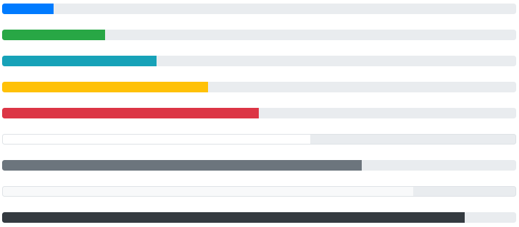
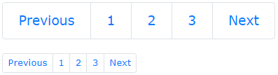
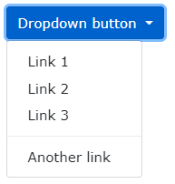

# Bootstrap 4

1. [Containers](#1. Containers)
2. [Grid System](#2. Grid System)
3. [Text / Typography](#3. Text / Typography)
4. [Colors](#4. Colors)
5. [Tables](#5. Tables)
6. [Images](#6. Images)
7. [Jumbotron](#7. Jumbotron)
8. [Alerts](#8. Alerts)
9. [Buttons](#9. Buttons)
10. [Button Groups](#10. Button Groups)
11. [Badges](#11. Badges)
12. [Progress Bar](#12. Progress Bar)
13. [Spinners](#13. Spinners)
14. [Pagination](#14. Pagination)
15. [List Groups](#15. List Groups)
16. [Cards](#16. Cards)
17. [Dropdowns](#17. Dropdowns)
18. [Collapse](#18. Collapse)
19. [Nav Menus](#19. Nav Menus)
20. [Navigation Bars](#20. Navigation Bars)
21. [Forms](#21. Forms)
22. [Inputs](#22. Inputs)


## 1. Containers

`.container` **fixed** width container.

`.container-fluid` **full** width container.


>For `.container-fluid`, width is always 100%.
>
>For `.container`, depends of the viewport width:

| .container | ExtraSmall | Small | Medium | Large | ExtraLarge |
| ---------- | ---------- | ----- | ------ | ----- | ---------- |
| max-width  | 100%       | 540px | 720px  | 960px | 1140px     |


#### 1.1 Container Padding

By default, containers have 15px left and right padding, with no top or bottom padding. `.pt-1`, `.pt-2`, ..., `.pt-5` classes add extra padding and margin to make them look better. Example:

```html
<div class="container pt-3"></div>
```


#### 1.2 Container Border and Color

Other utilities than are also often used together with `.container` is: `border ` for borders, `bg-color` for backgrounds and `text-color` for the text. Examples:

```html
<div class="container p-3 my-3 border"></div>
<div class="container p-3 my-3 bg-dark text-white"></div>
<div class="container p-3 my-3 bg-primary text-white"></div>
```


#### 1.3 Responsive Containers

The `.container-sm` , `.container-md`, `.container-lg`, `.container-xl` classes create responsive containers, with adaptative **max-width** props.

|      Class      | < 576px | ≥ 576px | ≥ 768px | ≥ 992px | ≥ 1200px |
| :-------------: | :-----: | :-----: | :-----: | :-----: | :------: |
| `.container-sm` |  100%   |  540px  |  720px  |  960px  |  1140px  |
| `.container-md` |  100%   |  100%   |  720px  |  960px  |  1140px  |
| `.container-lg` |  100%   |  100%   |  100%   |  960px  |  1140px  |
| `.container-xl` |  100%   |  100%   |  100%   |  100%   |  1140px  |


## 2. Grid System

Bootstrap's grid sysyem is built with flexbox and allows up to 12 columns across the page. If you don't want to use all 12 columns individually, you can group them together to create wider columns.

The system is responsive, the columns will re-arrange automatically depending on the screen size. Make sure that the sum adds up to 12 or fewer (it is not required to use all 12 available columns).


#### 2.1 Grid Classes

The grid system has 5 classes than can be combined to create more dynamic and flexible layouts. 

| < 576px |  ≥ 576px   |  ≥ 768px   |  ≥ 992px   |  ≥ 1200px  |
| :-----: | :--------: | :--------: | :--------: | :--------: |
| `.col-` | `.col-sm-` | `.col-md-` | `.col-lg-` | `.col-xl-` |

> **Tip:** Each class scales up, so if you wish to set the same widths for `sm` and `md`, you only need to specify `sm`.


**Basic structure of a Bootstrap4 Grid**

```html
<!-- Control the column width, and how they should appear on different devices -->
<div class="row">
	<div class="col-*-*"></div>
  	<div class="col-*-*"></div>
</div>
<div class="row">
  	<div class="col-*-*"></div>
  	<div class="col-*-*"></div>
  	<div class="col-*-*"></div>
</div>

<!-- Or let Bootstrap automatically handle the layout -->
<div class="row">
  	<div class="col"></div>
  	<div class="col"></div>
  	<div class="col"></div>
</div>
```

**First example:** create a row (`<div class="row">`). Then, add the desired number of columns (tags with appropriate `.col-*-*` classes). The first star (\*) represents the responsiveness: **sm**, **md**, **lg** or **xl**, while the second star represents a number, which should add up to 12 for each row.

**Second example:** instead of adding a number to each `col`, let bootstrap handle the layout, to create equal width columns: 2 `col` = 50% width. 3 cols = 33.33% width. 4 cols = 25% width, etc. You can also use `.col-sm|md|lg|xl` to make the columns responsive.

Some examples:
```html
<!-- 3 columns with equal size -->
<div class="row">
    <div class="col">.col</div>
    <div class="col">.col</div>
    <div class="col">.col</div>
</div>

<!-- 4 columns, each one is 3/12 width. Cause it is 'col-sm', on mobile phones or screens less than 576px wide, the columns will stack vertically -->
<div class="row">
  	<div class="col-sm-3">.col-sm-3</div>
  	<div class="col-sm-3">.col-sm-3</div>
  	<div class="col-sm-3">.col-sm-3</div>
  	<div class="col-sm-3">.col-sm-3</div>
</div>

<!-- 2 colums, one 4/12 width and another 8/12 width. Stacked on movile size and scaling on larger screens -->
<div class="row">
	<div class="col-sm-4">.col-sm-4</div>
  	<div class="col-sm-8">.col-sm-8</div>
</div>
```


## 3. Text / Typography

B4 uses as default:

```css
text{
    font-size: 16px,
	line-height: 1.5,
	font-family: Helvetica Neue, Helvetica, Arial, sans-serif
}
p { margin-top: 0, margin-bottom: 1rem }
```


**Headings**: B4 also modifies the `<h1>` - `<h6>` headings with a bolder font and increased font-size.


**Display**: Display headings are used to stand out more than normal headings, with 4 classes to choose from: `.display-1`, `.display-2`, `.display-3`, `.display-4`.


**Small**: On B4, `<small>` element is used to create a lighter secondary text on any heading, like: 

```html
<h1>Main heading text <small>secondary text smaller</small> </h1>
```


**Abbr**: B4 styles `<abbr>` with a dotter border bottom.


**Blockquote**: Add `.blockquote` and `.blockquote-footer` when quoting:

```html
<blockquote class="blockquote">
    <p>Any random quote that anybody never said</p>
    <div class="blockquote-footer">Albert Einstein, 2025</div>
  </blockquote>
```


**Other elements**: B4 also styles some html elements like `<dl>`, `<code>`, `<kbd>` (useful for show keyboard shortcuts) and `<pre>`.  


**More typography classes**:

|          Class          | Description                                         |
| :---------------------: | --------------------------------------------------- |
|   `.font-weight-bold`   | Bold text                                           |
|  `.font-weight-bolder`  | Bolder text                                         |
|     `.font-italic`      | Italic text                                         |
|  `.font-weight-light`   | Light weight text                                   |
| `.font-weight-lighter`  | Lighter weight text                                 |
|  `.font-weight-normal`  | Normal text                                         |
|         `.lead`         | Makes a paragraph stand out                         |
|        `.small`         | Smaller text (80% of the size of the parent)        |
|      `.text-left`       | Left-aligned text                                   |
|     `.text-*-left`      | Left-aligned text on X size of screens              |
|      `.text-break`      | Prevents long text from breaking layout             |
|     `.text-center`      | Indicates center-aligned text                       |
|    `.text-*-center`     | Indicates center-aligned text on X size of screens  |
| `.text-decoration-none` | Removes the underline from a link                   |
|      `.text-right`      | Indicates right-aligned text                        |
|     `.text-*-right`     | Indicates right-aligned text on X size of screens   |
|     `.text-justify`     | Indicates justified text                            |
|    `.text-monospace`    | Monospaced text                                     |
|     `.text-nowrap`      | Indicates no wrap text                              |
|    `.text-lowercase`    | Indicates lowercased text                           |
|      `.text-reset`      | Resets the color (inherits it from its parent)      |
|    `.text-uppercase`    | Indicates uppercased text                           |
|   `.text-capitalize`    | Indicates capitalized text                          |
|      `.initialism`      | An `<abbr>` element in a slightly smaller font size |
|    `.list-unstyled`     | Removes the default style on list items             |
|     `.list-inline`      | Places all list items on a single line              |
|    `.pre-scrollable`    | Makes a `<pre>` element scrollable                  |


## 4. Colors

#### Text colors

Contextual classes that can be used to provide "meaning through colors"

`.text-muted` - Muted

`.text-primary` - <span style="color:blue">Important</span>

`.text-success` - <span style="color:green">Success</span>

`.text-info` - <span style="color:blue">Information</span>

`.text-warning` - <span style="color:orange">Warning</span>

`.text-danger` - <span style="color:red">Danger</span>

`.text-secondary` - <span style="color:gray">Secondary text</span>

`.text-white` - White text

`.text-dark` - <span style="color:gray">Dark gray text</span>

`.text-body` - Body color text (often black)

`.text-light` - Light text


> It can be used for style `<link>`s too. And it's possible to modify the opacity by `.text-black-50` or `.text-white-50` for 50% opacity.


#### Background colors

The classes for background colors are: `.bg-primary`, `.bg-success`, `.bg-info`, `.bg-warning`, `.bg-danger`, `.bg-secondary`, `.bg-dark` and `.bg-light`.


## 5. Tables

**Basic table**:  `.table` styles html tables with padding and horizontal dividers. 


**Striped rows**: `.table-striped` class adds zebra-stripes to a table.


**Bordered table**: `.table-bordered` class adds borders on all sides and cells.


**Over rows**: `.table-over` adds a hover effect (grey bg) on table rows.

**Dark table**: `.table-dark` adds a dark background and white color text.

**Dark striped table**: `.table-dark` and `.table-striped` can be combined.

**Dark over table**: `.table-dark` and `.table-over` can combine too.

**Borderless table**: `.table-borderless` removes borders from the table.


#### 5.1 Contextual table classes

Can be used to color the whole table (`<table>`), the table rows (`<tr>`) or table cells (`<td>`).

`.table-primary` - <span style="color:blue">Important</span>

`.table-success` - <span style="color:Green">Successful</span>

`.table-info` - <span style="color:blue">Information</span>

`.table-warning` - <span style="color:orange">Warning</span>

`.table-danger` - <span style="color:red">Danger</span>

`.table-active` - <span style="color:Grey">Hover color</span>

`.table-secondary` - <span style="color:Grey">Less important</span>

`.table-light` - <span style="color:gray">Light grey</span>

`.table-dark` - Dark gray


#### 5.2 Table heads and other tables

**Header row**: `.thead-dark` adds a dark background to a row, and `.thead-light` adds a gray one.

**Small table**: `.table-small`makes the tablet smaller by 50% normal cell padding.

**Responsive table**: `.table-responsive` adds a x-scrollbar if the table is too big horizontally. You can also decide when the table should get a scrollbar:

| Class                  | Screen width |
| ---------------------- | ------------ |
| `.table-responsive-sm` | < 576px      |
| `.table-responsive-md` | < 768px      |
| `.table-responsive-lg` | < 992px      |
| `.table-responsive-xl` | < 1200px     |


## 6. Images

`.rounded`: adds rounded corners.

`.rounded-circle`: shapes the image to a circle.

`.img-thumbnail`: shapes the image to a thumbnail (bordered).


**Aligning Images**

Use `.float-left` and  `.float-right` classes to float an image.


**Centered Image**

For center an image, add`.mx-auto` ( `margin: auto` )  and `.d-block` ( `display: block` ). 

```html

```


**Responsive Images**

Images come in all sizes. So do screen. Responsive images automatically adjust to fit the size of the screen. 

Create responsive images by adding an `.img-fluid` class to the `` tag. The image will then scale nicely to the parent element.

The `.img-fluid` class applies `max-width: 100%` and `height: auto` .


## 7. Jumbotron

A jumbotron indicates a big grey box for calling extra attention to some special content or information.

Use a `<div>` element with class `.jumbotron` to create one.

> **Tip:** Inside a jumbotron you can put nearly any valid HTML, including other Bootstrap elements/classes.


#### Full-width Jumbotron

Add `.jumbotron-fluid`, and a `.container` or `.container-fluid` inside of it.
```html
<div class="jumbotron jumbotron-fluid">
    <div class="container">
        <h1>Bootstrap Tutorial</h1>
        <p>Bootstrap is the most popular HTML, CSS...</p>
    </div>
</div>
```


## 8. Alerts

B4 provides an easy way to create predefined alert messages. The `.alert` class, followed by one of the contextual classes `.alert-success`, `.alert-info`, `.alert-warning`, `.alert-danger`, `.alert-primary`, `.alert-secondary`, `.alert-dark` or `.alert-light`:


```html
<div class="alert alert-success">
    <strong>Success!</strong> Successful or positive action.
</div>
```


#### Alert Links

Add `.alert-link` class to any links inside the alert box to create a matching colored links.

```html
<div class="alert alert-success">
    <strong>Success!</strong> You should <a href="#" class="alert-link">read this message</a>.
</div>
```


#### Closing Alerts

To close the alert message, add a `.alert-dismissible` class to the alert container. Then add `class="close"` and `data-dismiss="alert"` to a link or button element.

```html
<div class="alert alert-success alert-dismissible">
    <button type="button" class="close" data-dismiss="alert">&times
    </button>
    <strong>Success!</strong> Successful or positive action.
</div>
```

> **Tip:** `&times;` (x) is an HTML entity that is the preferred icon for close buttons, rather than the letter "x".
>
> For a list of all HTML Entities, [visit our HTML Entities Reference](https://www.w3schools.com/charsets/ref_html_entities_4.asp)


#### Animated Alerts

The `.fade` and `.show` classes adds fading effect when closing the alert message.

```html
<div class="alert alert-danger alert-dismissible fade show">
```


## 9. Buttons

B4 provides different styles of buttons, that can be used on `<a>`, `<button>`, or `<input>` elements.


```html
<button type="button" class="btn">Basic</button>
<button type="button" class="btn btn-primary">Primary</button>
<button type="button" class="btn btn-secondary">Secondary</button>
<button type="button" class="btn btn-success">Success</button>
<button type="button" class="btn btn-info">Info</button>
<button type="button" class="btn btn-warning">Warning</button>
<button type="button" class="btn btn-danger">Danger</button>
<button type="button" class="btn btn-dark">Dark</button>
<button type="button" class="btn btn-light">Light</button>
<button type="button" class="btn btn-link">Link</button>
```


#### Button Outline

B4 provides 8 outline/bordered buttons:


```html
<button type="button" class="btn btn-outline-primary">1</button>
<button type="button" class="btn btn-outline-secondary">2</button>
<button type="button" class="btn btn-outline-success">ok</button>
<button type="button" class="btn btn-outline-info">Info</button>
<button type="button" class="btn btn-outline-warning">Warn</button>
<button type="button" class="btn btn-outline-danger">Danger</button>
<button type="button" class="btn btn-outline-dark">Dark</button>
<button type="button" class="btn btn-outline-light text-dark"> Light</button>
```


#### Button Sizes

Use the `.btn-lg` or `btn-sm` classes for large or small buttons:


```html
<button type="button" class="btn btn-primary btn-lg">Large</button>
<button type="button" class="btn btn-primary">Default</button>
<button type="button" class="btn btn-primary btn-sm">Small</button>
```


#### Block Level Buttons

Add class `.btn-block` to create a block button with full width of parent element:


```html
<button type="button" class="btn btn-primary btn-block"></button>
```


#### Active / Disabled Buttons

The class `.active` makes a button appear pressed, and the `disabled` attribute makes a button unclickable. The `<a>` elements don't support `disabled` attrib, so must use `.disabled` class to make it visually appear disabled. 


```html
<button type="button" class="btn btn-primary active">Active</button>
<button type="button" class="btn btn-primary" disabled>Dis</button>
<a href="#" class="btn btn-primary disabled">Disabled LINK</a>
```


#### Spinner Buttons

You can add "spinners" to a button (see [Spinners section](#13. Spinners) to learn more about it).


```html
<button class="btn btn-primary">
  	<span class="spinner-border spinner-border-sm"></span> Loading
</button>
```


## 10. Button Groups

B4 allows you to group a series of buttons together (on a single line) in a button group. Use a `<div>` with `.btn-group` class to create one:


```html
<div class="btn-group">
  <button type="button" class="btn btn-primary">Apple</button>
  <button type="button" class="btn btn-primary">Samsung</button>
  <button type="button" class="btn btn-primary">Sony</button>
</div>
```

> **Tip:** Instead of applying button sizes to every button in a group, use class `.btn-group-lg` or `.btn-group-sm` for a large or a small button group:


#### Vertical Button Group

B4 also supports vertical button groups. Use `.btn-group-vertical`


#### Nesting Button Groups & Dropdown Menus

Nest button groups to create dropdown menus (you will learn more about dropdowns in a later chapter)


```html
<div class="btn-group">
  	<button type="button" class="btn btn-primary">Apple</button>
  	<button type="button" class="btn btn-primary">Samsung</button>
  	<div class="btn-group">
    	<button type="button" class="btn btn-primary dropdown-toggle" data-toggle="dropdown">
       Sony
    	</button>
    	<div class="dropdown-menu">
      	<a class="dropdown-item" href="#">Tablet</a>
      	<a class="dropdown-item" href="#">Smartphone</a>
    	</div>
  	</div>
</div>
```


#### Split Button Dropdowns


```html
<div class="btn-group">
  	<button type="button" class="btn btn-primary">Sony</button>
  	<button type="button" class="btn btn-primary dropdown-toggle dropdown-toggle-split" data-toggle="dropdown">
    	<span class="caret"></span>
  	</button>
  	<div class="dropdown-menu">
    	<a class="dropdown-item" href="#">Tablet</a>
    	<a class="dropdown-item" href="#">Smartphone</a>
  	</div>
</div>
```


#### Vertical Button Group w/ Dropdown


```html
<div class="btn-group-vertical">
  	<button type="button" class="btn btn-primary">Apple</button>
  	<button type="button" class="btn btn-primary">Samsung</button>
  	<div class="btn-group">
    	<button type="button" class="btn btn-primary dropdown-toggle" data-toggle="dropdown">Sony</button>
       	<div class="dropdown-menu">
      		<a class="dropdown-item" href="#">Tablet</a>
      		<a class="dropdown-item" href="#">Smartphone</a>
    	</div>
  	</div>
</div>
```


#### Button Groups Side by Side

Button groups are "inline" by default, which makes them appear side by side when you have multiple groups:


```html
<div class="btn-group">
  <button type="button" class="btn btn-primary">Apple</button>
  <button type="button" class="btn btn-primary">Samsung</button>
  <button type="button" class="btn btn-primary">Sony</button>
</div>
<div class="btn-group">
  <button type="button" class="btn btn-primary">BMW</button>
  <button type="button" class="btn btn-primary">Mercedes</button>
  <button type="button" class="btn btn-primary">Volvo</button>
</div>
```


## 11. Badges

Badges are used to add additional information to any content. Use the `.badge` class together with a contextual class (like `.badge-secondary`) within `<span>` elements to create rectangular badges. Note that badges scale to match the size of the parent element (if any).


#### Contextual Badges

Use any of the contextual classes (`.badge-*`) to change the color of a badge:


#### Pill Badges

Use the `.badge-pill` class to make the badges more round:


#### Badge inside an Element

An example of using a badge inside a button: 

```html
<button type="button" class="btn btn-primary">
  	Messages <span class="badge badge-light"> 4 </span>
</button>
```


## 12. Progress Bar

It can be used to show users how far along they are in a process.


To create a default progress bar, add a `.progress` class to a container element and add the `.progress-bar` class to its child element. Use the CSS `width` property to set the % of progress.

```html
<div class="progress">
  	<div class="progress-bar" style="width:70%"></div>
</div>
```


#### Progress Bar Height

The default height of the progress bar is `16px`. Use the CSS `height` property to change it. You must set the same height for the progress container and bar:


```html
<div class="progress" style="height:20px">
  	<div class="progress-bar" style="width:40%, height:20px"></div>
</div>
```


#### Progress Bar Labels

Add text inside the progress bar to show the visible percentage:


```html
<div class="progress">
  	<div class="progress-bar" style="width: 70%"> 70% </div>
</div>
```


#### Colored Progress Bar

By default the progress bar is blue (primary). Use any of the B4 contextual background classes to its color:



```html
<!-- Blue -->
<div class="progress">
  	<div class="progress-bar" style="width:10%"></div>
</div>

<!-- Green -->
<div class="progress">
  	<div class="progress-bar bg-success" style="width:20%"></div>
</div>

<!-- Turquoise -->
<div class="progress">
  	<div class="progress-bar bg-info" style="width:30%"></div>
</div>

<!-- Orange -->
<div class="progress">
   <div class="progress-bar bg-warning" style="width:40%"></div>
</div>

<!-- Red -->
<div class="progress">
  	<div class="progress-bar bg-danger" style="width:50%"></div>
</div>

<!-- White -->
<div class="progress border">
  	<div class="progress-bar bg-white" style="width:60%"></div>
</div>

<!-- Grey -->
<div class="progress">
  	<div class="progress-bar bg-secondary" style="width:70%"></div>
</div>

<!-- Light Grey -->
<div class="progress border">
  	<div class="progress-bar bg-light" style="width:80%"></div>
</div>

<!-- Dark Grey -->
<div class="progress">
  	<div class="progress-bar bg-dark" style="width:90%"></div>
</div>
```


#### Striped Progress Bar

Use the `.progress-bar-striped` class to add stripes to the progress bars:


```html
<div class="progress">
  <div class="progress-bar progress-bar-striped" style="width:40%"></div> </div>
```


#### Animated Progress Bar

Add the `.progress-bar-animated` class to  animate the striped progress bar

```html
<div class="progress-bar progress-bar-striped progress-bar-animated" style="width:40%"></div>
```


#### Multiple Progress Bars

Progress bars can also be stacked:


```html
<div class="progress">
  <div class="progress-bar bg-success" style="width:40%">Free</div>
  <div class="progress-bar bg-warning" style="width:10%">Warn</div>
  <div class="progress-bar bg-danger" style="width:20%">Danger</div>
</div>
```


## 13. Spinners

To create a spinner/loader, use the `.spinner-border` class:       

```html
<div class="spinner-border"></div>
```


#### Colored Spinners

Use any **text color utilites** to add a color to the spinner:


```html
<div class="spinner-border text-muted"></div>
<div class="spinner-border text-primary"></div>
<div class="spinner-border text-success"></div>
<div class="spinner-border text-info"></div>
<div class="spinner-border text-warning"></div>
<div class="spinner-border text-danger"></div>
<div class="spinner-border text-secondary"></div>
<div class="spinner-border text-dark"></div>
<div class="spinner-border text-light"></div>
```


#### Growing Spinners

Use the `.spinner-grow` class if you want the spinner/loader to grow instead:


```html
<div class="spinner-grow text-muted"></div>
<div class="spinner-grow text-primary"></div>
<div class="spinner-grow text-success"></div>
<div class="spinner-grow text-info"></div>
<div class="spinner-grow text-warning"></div>
<div class="spinner-grow text-danger"></div>
<div class="spinner-grow text-secondary"></div>
<div class="spinner-grow text-dark"></div>
<div class="spinner-grow text-light"></div>
```


#### Spinner Size

Use `.spinner-border-sm` or `.spinner-grow-sm` for a smaller spinner:  

```html
<div class="spinner-border spinner-border-sm"></div>
<div class="spinner-grow spinner-grow-sm"></div>
```


#### Spinner Buttons

You can also add spinners to a button, with or without text:


````html
<button class="btn btn-primary">
	<span class="spinner-border spinner-border-sm"></span>
</button>

<button class="btn btn-primary">
  	<span class="spinner-border spinner-border-sm"></span> Loading..
</button>

<button class="btn btn-primary" disabled>
  	<span class="spinner-border spinner-border-sm"></span> Loading..
</button>

<button class="btn btn-primary" disabled>
      <span class="spinner-grow spinner-grow-sm"></span> Loading..
</button>
````


## 14. Pagination

For a multi-page web sites, you can add some sort of pagination.


For basic pagination, add `.pagination` class to an `<ul>` element. Then add the `.page-item` to each `<li>` and a `.page-link` class to each `<a>` inside `<li>`:

````html
<ul class="pagination">
   <li class="page-item"><a class="page-link" href="#">Pre</a></li>
   <li class="page-item"><a class="page-link" href="#">1</a></li>
   <li class="page-item"><a class="page-link" href="#">2</a></li>
   <li class="page-item"><a class="page-link" href="#">3</a></li>
   <li class="page-item"><a class="page-link" href="#">Next</a></li>
</ul>
````


#### Active State

The `.active` class is used to "highlight" the current page:


````html
<ul class="pagination">
   <li class="page-item"><a class="page-link" href="#">Pre</a></li>
   <li class="page-item"><a class="page-link" href="#">1</a></li>
   <li class="page-item active"><a class="page-link" href="#">2</a>    </li>
   <li class="page-item"><a class="page-link" href="#">3</a></li>
   <li class="page-item"><a class="page-link" href="#">Next</a></li>
</ul>
````


#### Disabled State

The `.disabled` class is used for un-clickable links:


````html
<ul class="pagination">
   <li class="page-item disabled"><a class="page-link" href="#">Previous</a></li>
   <li class="page-item"><a class="page-link" href="#">1</a></li>
   <li class="page-item"><a class="page-link" href="#">2</a></li>
   <li class="page-item"><a class="page-link" href="#">3</a></li>
   <li class="page-item"><a class="page-link" href="#">Next</a></li>
</ul>
````


#### Pagination Sizing

Pagination blocks can also be sized to a larger or a smaller size. Add class `.pagination-lg` for larger blocks or `.pagination-sm` for smaller blocks:



````html
<ul class="pagination pagination-lg">
  <li class="page-item"><a class="page-link" href="#">Pre</a></li>
  <li class="page-item"><a class="page-link" href="#">1</a></li>
  <li class="page-item"><a class="page-link" href="#">2</a></li>
  <li class="page-item"><a class="page-link" href="#">3</a></li>
  <li class="page-item"><a class="page-link" href="#">Next</a></li>
</ul>

<ul class="pagination pagination-sm">
  <li class="page-item"><a class="page-link" href="#">Pre</a></li>
  <li class="page-item"><a class="page-link" href="#">1</a></li>
  <li class="page-item"><a class="page-link" href="#">2</a></li>
  <li class="page-item"><a class="page-link" href="#">3</a></li>
  <li class="page-item"><a class="page-link" href="#">Next</a></li>
</ul>
````


#### Pagination Alignment

Use utility classes to change the alignment of the pagination:


````html
<!-- Default (left-aligned) -->
<ul class="pagination" style="margin:20px 0">
  	<li class="page-item">...</li>
</ul>

<!-- Center-aligned -->
<ul class="pagination justify-content-center" style="margin:20px 0">
  	<li class="page-item">...</li>
</ul>

<!-- Right-aligned -->
<ul class="pagination justify-content-end" style="margin:20px 0">
  	<li class="page-item">...</li>
</ul>
````

> **Tip:** Read more about Bootstrap 4 Utility/Helper classes in our [BS4 Utilities](https://www.w3schools.com/bootstrap4/bootstrap_utilities.asp).


#### Breadcrumbs

Another form for pagination, is breadcrumbs. 


The `.breadcrumb` and `.breadcrumb-item` classes indicates the current page's location within a navigational hierarchy:

````html
<ul class="breadcrumb">
  	<li class="breadcrumb-item"><a href="#">Photos</a></li>
  	<li class="breadcrumb-item"><a href="#">Summer 2017</a></li>
  	<li class="breadcrumb-item"><a href="#">Italy</a></li>
  	<li class="breadcrumb-item active">Rome</li>
</ul>
````


## 15. List Groups

The basic list group is an unordered list with items. To create a list group, use an `<ul>` element with class `.list-group`, and `<li>` with `.list-group-item`:


````html
<ul class="list-group">
  	<li class="list-group-item">First item</li>
  	<li class="list-group-item">Second item</li>
  	<li class="list-group-item">Third item</li>
</ul>
````


#### Active State

Use the `.active` class to highlight the current item:


```html
<ul class="list-group">
  	<li class="list-group-item active">Active item</li>
  	<li class="list-group-item">Second item</li>
 	 <li class="list-group-item">Third item</li>
</ul>
```


#### List Group w/ Linked Items

To create a list group with linked items, use `<div>` instead of `<ul>` and `<a>` instead of `<li>`. Optionally, add the `.list-group-item-action` class if you want a grey background color on hover:

```html
<div class="list-group">
  <a href="#" class="list-group-item list-group-item-action">1</a>
  <a href="#" class="list-group-item list-group-item-action">2</a>
  <a href="#" class="list-group-item list-group-item-action">3</a>
</div>
```


#### Disabled Item

The `.disabled` class adds a lighter text color to the disabled item. And when used on links, it will remove the hover effect:


```html
<div class="list-group">
  <a href="#" class="list-group-item disabled">Disabled item</a>
  <a href="#" class="list-group-item disabled">Disabled item</a>
  <a href="#" class="list-group-item">Third item</a>
</div>
```


#### Flush / Remove Borders

The `.list-group-flush` class removes some borders and rounds corners:

```html
<ul class="list-group list-group-flush">
	<li class="list-group-item">First item</li>
  	<li class="list-group-item">Second item</li>
  	<li class="list-group-item">Third item</li>
</ul>
```


#### Horizontal List Groups

To display the list items horizontally instead of vertically, add `.list-group-horizontal` class to `.list-group`:


```html
<ul class="list-group list-group-horizontal">
  	<li class="list-group-item">First item</li>
  	<li class="list-group-item">Second item</li>
  	<li class="list-group-item">Third item</li>
</ul>
```


#### Contextual Classes

Contextual classes can be used to color list items:


```html
<ul class="list-group">
  <li class="list-group-item list-group-item-success">Success</li>
  <li class="list-group-item list-group-item-secondary">Second</li>
  <li class="list-group-item list-group-item-info">Info</li>
  <li class="list-group-item list-group-item-warning">Warning</li>
  <li class="list-group-item list-group-item-danger">Danger</li>
  <li class="list-group-item list-group-item-primary">Primary</li>
  <li class="list-group-item list-group-item-dark">Dark</li>
  <li class="list-group-item list-group-item-light">Light</li>
</ul>
```


#### Link Items w/ Contextual Classes

```html
<div class="list-group">
  <a href="#" class="list-group-item list-group-item-action">Action item</a>
  <a href="#" class="list-group-item list-group-item-action list-group-item-success">Success item</a>
  <a href="#" class="list-group-item list-group-item-action list-group-item-secondary">Secondary item</a>
  <a href="#" class="list-group-item list-group-item-action list-group-item-info">Info item</a>
  <a href="#" class="list-group-item list-group-item-action list-group-item-warning">Warning item</a>
  <a href="#" class="list-group-item list-group-item-action list-group-item-danger">Danger item</a>
  <a href="#" class="list-group-item list-group-item-action list-group-item-primary">Primary item</a>
  <a href="#" class="list-group-item list-group-item-action list-group-item-dark">Dark item</a>
  <a href="#" class="list-group-item list-group-item-action list-group-item-light">Light item</a>
</div>
```


#### List Group w/ Badges

Combine `.badge` classes with utility classes to add badges inside the list group:


```html
<ul class="list-group">
  	<li class="list-group-item d-flex justify-content-between align-items-center">
    	Inbox
    	<span class="badge badge-primary badge-pill">12</span>
  	</li>
  	<li class="list-group-item d-flex justify-content-between align-items-center">
    	Ads
    	<span class="badge badge-primary badge-pill">50</span>
  	</li>
  	<li class="list-group-item d-flex justify-content-between align-items-center">
    	Junk
    	<span class="badge badge-primary badge-pill">99</span>
  	</li>
</ul>
```


## 16. Cards
<div><p style="width: 60%; float: left">A card in Bootstrap 4 is a bordered box with some padding around its content. It includes options for headers, footers, content, colors, etc.</p>

</div>


#### Basic card

A basic card is created with `.card` class, content inside has a `.card-body`:


```` html
<div class="card"> <div class="card-body">Basic card</div> </div>
````


#### Header and Footer

The `.card-header` class adds a heading to the card and the `.card-footer` class adds a footer to the card:


```html
<div class="card">
  	<div class="card-header">Header</div>
  	<div class="card-body">Content</div>
  	<div class="card-footer">Footer</div>
</div>
```


#### Contextual Cards

To add a background color the card, use `.bg-primary`, `.bg-success`, `.bg-info`, `.bg-warning`, `.bg-danger`, `.bg-secondary`, `.bg-dark` and `.bg-light`.


#### Tiles, Text and Links

Use `.card-title` to add card titles to any heading element. The `.card-text` class is used to remove bottom margins for a `<p>` element if it is the last child (or the only one) inside `.card-body`. The `.card-link` class adds a blue color to any link, and a hover effect.


```html
<div class="card">
  	<div class="card-body">
    	<h4 class="card-title">Card title</h4>
    	<p class="card-text">Some example text.</p>
    	<a href="#" class="card-link">Card link</a>
    	<a href="#" class="card-link">Another link</a>
  	</div>
</div>
```


#### Card Images

Add `.card-img-top` or `.card-img-bottom` to an `` to place the image at the top or at the bottom inside the card. Note that we have added the image outside of the `.card-body` to span the entire width:


```html
<div class="card" style="width:400px">
  	
  	<div class="card-body">
    	<h4 class="card-title">John Doe</h4>
    	<p class="card-text">Some example text.</p>
    	<a href="#" class="btn btn-primary">See Profile</a>
 	 </div>
</div>
```


#### Stretched Link

Add the `.stretched-link` class to a link inside the card, and it will make the whole card clickable and hoverable (the card will act as a link):

```html
<a href="#" class="btn btn-primary stretched-link">See Profile</a>
```


#### Card Image Overlays

<div><p style="width: 60%; float: left">Turn an image into a card background and use <code>.card-img-overlay</code> to add text on top of the image:</p>

</div>


```html
<div class="card" style="width:500px">
  	
  	<div class="card-img-overlay">
    	<h4 class="card-title">John Doe</h4>
    	<p class="card-text">Some example text.</p>
    	<a href="#" class="btn btn-primary">See Profile</a>
 	 </div>
</div>
```


#### Card Columns

The `.card-columns` class creates a masonry-like grid of cards (like pinterest). The layout will automatically adjust as you insert more cards.

> **Note:** The cards are displayed vertically on small screens ( < 576px )


```html
<div class="card-columns">
  <div class="card bg-primary">
    <div class="card-body text-center">
      <p class="card-text">Some text inside the first card</p>
    </div>
  </div>
  <div class="card bg-warning">
    <div class="card-body text-center">
      <p class="card-text">Some text inside the second card</p>
    </div>
  </div>
  <div class="card bg-success">
    <div class="card-body text-center">
      <p class="card-text">Some text inside the third card</p>
    </div>
  </div>
  <div class="card bg-danger">
    <div class="card-body text-center">
      <p class="card-text">Some text inside the fourth card</p>
    </div>
  </div>
  <div class="card bg-light">
    <div class="card-body text-center">
      <p class="card-text">Some text inside the fifth card</p>
    </div>
  </div>
  <div class="card bg-info">
    <div class="card-body text-center">
      <p class="card-text">Some text inside the sixth card</p>
    </div>
  </div>
</div>
```


#### Card Deck

The `.card-deck` class creates a grid of cards that are of **equal height and width**. The layout will automatically adjust as you insert more cards.

> **Note:** The cards are displayed vertically on small screens ( < 576px ).


```html
<div class="card-deck">
  <div class="card bg-primary">
    <div class="card-body text-center">
      <p class="card-text">Some text inside the first card</p>
    </div>
  </div>
  <div class="card bg-warning">
    <div class="card-body text-center">
      <p class="card-text">Some text inside the second card</p>
    </div>
  </div>
  <div class="card bg-success">
    <div class="card-body text-center">
      <p class="card-text">Some text inside the third card</p>
    </div>
  </div>
  <div class="card bg-danger">
    <div class="card-body text-center">
      <p class="card-text">Some text inside the fourth card</p>
    </div>
  </div>
</div>
```


#### Card Group

The `.card-group` class is similar to `.card-deck`. The only difference is that the `.card-group` class removes left and right margins between each card.

>  **Note:** The cards are displayed vertically on small screens ( < 576px ), **WITH** top and bottom margin:


```html
<div class="card-group">
  <div class="card bg-primary">
    <div class="card-body text-center">
      <p class="card-text">Some text inside the first card</p>
    </div>
  </div>
  <div class="card bg-warning">
    <div class="card-body text-center">
      <p class="card-text">Some text inside the second card</p>
    </div>
  </div>
  <div class="card bg-success">
    <div class="card-body text-center">
      <p class="card-text">Some text inside the third card</p>
    </div>
  </div>
  <div class="card bg-danger">
    <div class="card-body text-center">
      <p class="card-text">Some text inside the fourth card</p>
    </div>
  </div>
</div>
```


## 17. Dropdowns

<div><p style="width: 60%; float: left">A dropdown is a toggleable menu that allows the user to choose one value from a predefined list:</p>

</div>


```html
<div class="dropdown">
	<button type="button" class="btn btn-primary dropdown-toggle" data-toggle="dropdown">Dropdown button</button>
  	<div class="dropdown-menu">
        <a class="dropdown-item" href="#">Link 1</a>
    	<a class="dropdown-item" href="#">Link 2</a>
    	<a class="dropdown-item" href="#">Link 3</a>
  	</div>
</div>
```

**Example explained:** The `.dropdown` class indicates a dropdown menu. To open the dropdown menu, use a button or a link with a class of `.dropdown-toggle` and the `data-toggle="dropdown"` attribute.

Add the `.dropdown-menu` class to a `<div>` element to build the dropdown. Then add the `.dropdown-item` class to each element (`<a>` or `<button>`) inside it.


#### Dropdown Divider

The `.dropdown-divider` class is used to separate links inside the dropdown menu with a thin horizontal border:



```html
<div class="dropdown-divider"> </div>
```


#### Dropdown Header

The `.dropdown-header` class is used to add headers inside the dropdown:


```html
<div class="dropdown-header">Dropdown header 1</div>
```


#### Disabled and Active items

Highlight a specific dropdown item with the `.active` class. To disable an item in the dropdown menu, use the `.disabled` class.


```html
<a class="dropdown-item active" href="#">Active</a>
<a class="dropdown-item disabled" href="#">Disabled</a>
```


#### Dropdown Position

You can also create a "dropright" or "dropleft" menu, by adding the `.dropright` or `.dropleft` class to the dropdown. Note that the arrow is added automatically:

<div>


</div>


````html
<div class="dropdown dropright"></div>
<div class="dropdown dropleft"></div>
````


#### Dropdown Menu Right

To right-align the dropdown menu, add the `.dropdown-menu-right` class:

```html
<div class="dropdown-menu dropdown-menu-right">
```


#### Dropup

If you want the dropdown menu to expand upwards instead of downwards, change the `<div>` element with `class="dropdown"` to `"dropup"`:

````html
<div class="dropup">
````


#### Dropdown Text

The `.dropdown-item-text` class is used to add plain text to a dropdown item, or used on links for default link styling.

````html
<div class="dropdown-menu">
  <a class="dropdown-item" href="#">Link 1</a>
  <a class="dropdown-item" href="#">Link 2</a>
  <a class="dropdown-item-text" href="#">Text Link</a>
  <span class="dropdown-item-text">Just Text</span>
</div>
````


#### Grouped Buttons w/ a Dropdown

```html
<div class="btn-group">
  	<button type="button" class="btn btn-primary">Apple</button>
  	<button type="button" class="btn btn-primary">Samsung</button>
  	<div class="btn-group">
    	<button type="button" 
                class="btn btn-primary dropdown-toggle" 
                data-toggle="dropdown">Sony
        </button>
        <div class="dropdown-menu">
      		<a class="dropdown-item" href="#">Tablet</a>
      		<a class="dropdown-item" href="#">Smartphone</a>
    	</div>
  	</div>
</div>
```


#### Split Button Dropdowns


```html
<div class="btn-group">
  	<button type="button" class="btn btn-primary">Primary</button>
  	<button type="button" class="btn btn-primary dropdown-toggle 		dropdown-toggle-split" data-toggle="dropdown">
  	</button>
  	<div class="dropdown-menu">
    	<a class="dropdown-item" href="#">Link 1</a>
    	<a class="dropdown-item" href="#">Link 2</a>
  	</div>
</div>
```


#### Vertical Button Group w/ Dropdown

```html
<div class="btn-group-vertical">
  	<button type="button" class="btn btn-primary">Apple</button>
  	<button type="button" class="btn btn-primary">Samsung</button>
  	<div class="btn-group">
    	<button type="button" 
                class="btn btn-primary dropdown-toggle" 
                data-toggle="dropdown">Sony</button>
    	<div class="dropdown-menu">
      		<a class="dropdown-item" href="#">Tablet</a>
      		<a class="dropdown-item" href="#">Smartphone</a>
    	</div>
  	</div>
</div>
```


> More info on [Bootstrap 4 JS Dropdown Reference](https://www.w3schools.com/bootstrap4/bootstrap_ref_js_dropdown.asp).


## 18. Collapse

Collapsibles allow you to hide and show large amount of content.

```html
<button data-toggle="collapse" data-target="#demo"> Collapsible </button>
<div id="demo" class="collapse"> Lorem ipsum </div>
```

The `.collapse` class indicates a collapsible element (a `<div>` in our example); this is the content that will be shown or hidden with a click of a button.

To control (show/hide) the collapsible content, add the `data-toggle="collapse"` attribute to an `<a>` or a `<button>` element. Then add the `data-target="#id"` attribute to connect the button with the collapsible content (`<div id="demo">`).

>  **Note:** For `<a>`, you can use the `href` attrib instead of the `data-target`.

```html
<a href="#demo" data-toggle="collapse"> Collapsible </a>
<div id="demo" class="collapse"> Lorem ipsum </div>
```

By default, the collapsible content is hidden. However, you can add the `.show` class to show the content by default:

```html
<div id="demo" class="collapse show"> Lorem ipsum </div>
```


#### Accordion

The example shows a simple accordion by extending the card component.

> **Note:** Use the `data-parent` attribute to make sure that all collapsible elements under the specified parent will be closed when one of the collapsible item is shown.

```html
<div id="accordion">
  	<div class="card">
    	<div class="card-header">
      		<a class="card-link" data-toggle="collapse" 
               href="#group1"> Collapsible Group #1 </a>
        </div>
    	<div id="group1" class="collapse show" 
             data-parent="#accordion">
      		<div class="card-body"> Text 1... </div>
    	</div>
  	</div>

  	<div class="card">
    	<div class="card-header">
      		<a class="collapsed card-link" data-toggle="collapse" 
               href="#group2"> Collapsible Group #2 </a>
    	</div>
    	<div id="group2" class="collapse" 
             data-parent="#accordion">
      		<div class="card-body"> Text 2... </div>
    	</div>
  	</div>

  	<div class="card">
    	<div class="card-header">
      		<a class="collapsed card-link" data-toggle="collapse" 
               href="#group3"> Collapsible Group #3 </a>
    	</div>
    	<div id="group3" class="collapse" data-parent="#accordion">
      		<div class="card-body"> Text 3... </div>
    	</div>
  	</div>
</div>
```


## 19. Nav Menus

To create a simple horizontal menu, add the `.nav` class to a `<ul>` element, followed by `.nav-item` for each `<li>` and add the `.nav-link` class to their links:

```html
<ul class="nav">
  	<li class="nav-item">
    	<a class="nav-link" href="#">Link</a>
  	</li>
  	<li class="nav-item">
    	<a class="nav-link" href="#">Link</a>
  	</li>
  	<li class="nav-item">
    	<a class="nav-link" href="#">Link</a>
 	</li>
  	<li class="nav-item">
    	<a class="nav-link disabled" href="#">Disabled</a>
  	</li>
</ul>
```


#### Aligned Nav

Add the `.justify-content-center` class to center the nav, and the `.justify-content-end` class to right-align the nav.

```html
<!-- Centered nav -->
<ul class="nav justify-content-center">
<!-- Right-aligned nav -->
<ul class="nav justify-content-end">
```


#### Vertical Nav

Add the `.flex-column` class to create a vertical nav.

```html
<ul class="nav flex-column">
```


#### Tabs

Turn the nav menu into navigation tabs with the `.nav-tabs` class. Add the `.active` class to the active/current link. If you want the tabs to be togglable, see the last example on this page.

```html
<ul class="nav nav-tabs">
  	<li class="nav-item">
    	<a class="nav-link active" href="#">Active</a>
  	</li>
  	<li class="nav-item">
    	<a class="nav-link" href="#">Link</a>
  	</li>
  	<li class="nav-item">
    	<a class="nav-link" href="#">Link</a>
  	</li>
  	<li class="nav-item">
    	<a class="nav-link disabled" href="#">Disabled</a>
  	</li>
</ul>
```


#### Pills

Turn the nav menu into navigation pills with the `.nav-pills` class. If you want the pills to be togglable, see the last example on this page.

```html
<ul class="nav nav-pills">
  	<li class="nav-item">
    	<a class="nav-link active" href="#">Active</a>
  	</li>
  	<li class="nav-item">
    	<a class="nav-link" href="#">Link</a>
  	</li>
  	<li class="nav-item">
    	<a class="nav-link" href="#">Link</a>
  	</li>
  	<li class="nav-item">
    	<a class="nav-link disabled" href="#">Disabled</a>
  	</li>
</ul>
```


#### Justified Tabs/Pills

Justify the tabs/pills with the `.nav-justified` class (equal width):

```html
<ul class="nav nav-pills nav-justified">...</ul>
<ul class="nav nav-tabs nav-justified">...</ul>
```


#### Pills w/ Dropdown

```html
<ul class="nav nav-pills">
   <li class="nav-item">
     <a class="nav-link active" href="#">Active</a>
   </li>
   <li class="nav-item dropdown">
     <a class="nav-link dropdown-toggle" data-toggle="dropdown" 
        href="#">Dropdown</a>
     <div class="dropdown-menu">
      	<a class="dropdown-item" href="#">Link 1</a>
      	<a class="dropdown-item" href="#">Link 2</a>
      	<a class="dropdown-item" href="#">Link 3</a>
    	</div>
  	</li>
  	<li class="nav-item">
    	<a class="nav-link" href="#">Link</a>
  	</li>
  	<li class="nav-item">
    	<a class="nav-link disabled" href="#">Disabled</a>
  	</li>
</ul>
```


#### Tabs w/ Dropdown

```html
<ul class="nav nav-tabs">
  	<li class="nav-item">
    	<a class="nav-link active" href="#">Active</a>
  	</li>
  	<li class="nav-item dropdown">
    	<a class="nav-link dropdown-toggle" data-toggle="dropdown" 
           href="#">Dropdown</a>
    	<div class="dropdown-menu">
      		<a class="dropdown-item" href="#">Link 1</a>
      		<a class="dropdown-item" href="#">Link 2</a>
      		<a class="dropdown-item" href="#">Link 3</a>
    	</div>
  	</li>
  	<li class="nav-item">
    	<a class="nav-link" href="#">Link</a>
  	</li>
  	<li class="nav-item">
    	<a class="nav-link disabled" href="#">Disabled</a>
  	</li>
</ul>
```


#### Toggleable / Dynamic Tabs

To make the tabs toggleable, add the `data-toggle="tab"` attribute to each link. Then add a `.tab-pane` class with a unique ID for every tab and wrap them inside a `<div>` element with class `.tab-content`.

If you want the tabs to fade in and out when clicking on them, add the `.fade` class to `.tab-pane`:

```html
<!-- Nav tabs -->
<ul class="nav nav-tabs">
  <li class="nav-item">
    <a class="nav-link active" data-toggle="tab" 
       href="#home">Home</a>
  </li>
  <li class="nav-item">
    <a class="nav-link" data-toggle="tab" href="#menu1">Menu 1</a>
  </li>
  <li class="nav-item">
    <a class="nav-link" data-toggle="tab" href="#menu2">Menu 2</a>
  </li>
</ul>

<!-- Tab panes -->
<div class="tab-content">
  <div class="tab-pane container active" id="home">...</div>
  <div class="tab-pane container fade" id="menu1">...</div>
  <div class="tab-pane container fade" id="menu2">...</div>
</div>
```


#### Toggleable / Dynamic Pills

The same code applies to pills; only change the attribute `data-toggle="pill"`:

```html
<!-- Nav pills -->
<ul class="nav nav-pills">
  <li class="nav-item">
    <a class="nav-link active" data-toggle="pill" href="#home">Home</a>
  </li>
  <li class="nav-item">
    <a class="nav-link" data-toggle="pill" href="#menu1">Menu 1</a>
  </li>
  <li class="nav-item">
    <a class="nav-link" data-toggle="pill" href="#menu2">Menu 2</a>
  </li>
</ul>

<!-- Tab panes -->
<div class="tab-content">
  <div class="tab-pane container active" id="home">...</div>
  <div class="tab-pane container fade" id="menu1">...</div>
  <div class="tab-pane container fade" id="menu2">...</div>
</div>
```


## 20. Navigation Bars

A navigation bar is a navigation header that is placed at the top of the page:


#### Basic Navbar

With Bootstrap, a navigation bar can extend or collapse, depending on the screen size.

A standard navigation bar is created with the `.navbar` class, followed by a responsive collapsing class: `.navbar-expand-xl|lg|md|sm` (stacks the navbar vertically on extra large, large, medium or small screens).

To add links inside the navbar, use a `<ul class="navbar-nav">`. Then add `<li class="nav-item">` elements followed by `<a class="nav-link">` elements.

```html
<!-- Horizontal navbar that becomes vertical on small screens -->
<nav class="navbar navbar-expand-sm bg-light">
  	<ul class="navbar-nav">
    	<li class="nav-item">
      		<a class="nav-link" href="#">Link 1</a>
    	</li>
    	<li class="nav-item">
      		<a class="nav-link" href="#">Link 2</a>
    	</li>
    	<li class="nav-item">
      		<a class="nav-link" href="#">Link 3</a>
    	</li>
  	</ul>
</nav>
```


#### Vertical Navbar

Remove the `.navbar-expand-xl|lg|md|sm` to create a vertical navigation bar:

```html
<nav class="navbar bg-light">
  	<ul class="navbar-nav">
    	<li class="nav-item">
      		<a class="nav-link" href="#">Link 1</a>
    	</li>
    	<li class="nav-item">
      		<a class="nav-link" href="#">Link 2</a>
    	</li>
    	<li class="nav-item">
      		<a class="nav-link" href="#">Link 3</a>
    	</li>
  	</ul>
</nav>
```


#### Centered Navbar

Add the `.justify-content-center` class to center the navigation bar.

The example will center the navbar, but on small screens it will be displayed vertically and left-aligned (because of the `.navbar-expand-sm class`):

```html
<nav class="navbar navbar-expand-sm bg-light justify-content-center">
  ...
</nav>
```


#### Colored Navbar


Use any of the `.bg-color` to change the color (`.bg-primary`, `.bg-success`, `.bg-info`, `.bg-warning`, `.bg-danger`, `.bg-secondary`, `.bg-dark` and `.bg-light`).

**Tip:** Add a **white** text color to all links in the navbar with the `.navbar-dark` class, or use the `.navbar-light` class to add a **black** text color.

```html
<!-- Grey with black text -->
<nav class="navbar navbar-expand-sm bg-light navbar-light">
  	<ul class="navbar-nav">
    	<li class="nav-item active">
      		<a class="nav-link" href="#">Active</a>
    	</li>
    	<li class="nav-item">
      		<a class="nav-link" href="#">Link</a>
    	</li>
    	<li class="nav-item">
      		<a class="nav-link" href="#">Link</a>
    	</li>
    	<li class="nav-item">
      		<a class="nav-link disabled" href="#">Disabled</a>
    	</li>
  	</ul>
</nav>
<!-- Black with white text -->
<nav class="navbar navbar-expand-sm bg-dark navbar-dark">...</nav>
<!-- Blue with white text -->
<nav class="navbar navbar-expand-sm bg-primary navbar-dark">...</nav>
```


> **Active/disabled state**: Add the `.active` class to an `<a>` to highlight the current link, or the `.disabled` class to indicate that the link is un-clickable.


#### Brand / Logo

The `.navbar-brand` class is used to highlight the brand/logo/project name:

```html
<nav class="navbar navbar-expand-sm bg-dark navbar-dark">
  	<a class="navbar-brand" href="#"> Logo </a>
  	...
</nav>
```

When using the `.navbar-brand` class on images, Bootstrap 4 will automatically style the image to fit the navbar vertically.


#### Collapsing The Navigation Bar

Very often, especially on small screens, you want to hide the navigation links and replace them with a button that should reveal them when clicked on.

To create a collapsible navigation bar, use:

```html
<button class='navbar-toggler' data-toggle='collapse' data-target='#id'>
```

Then wrap the navbar content (links, etc) inside a div element with `class="collapse navbar-collapse"`, followed by the id of the `data-target`.

```html
<nav class="navbar navbar-expand-md bg-dark navbar-dark">
  	<!-- Brand -->
  	<a class="navbar-brand" href="#">Navbar</a>

  	<!-- Toggler/collapsibe Button -->
  	<button class="navbar-toggler" type="button" 
            data-toggle="collapse" data-target="#collapsibleNavbar">
    	<span class="navbar-toggler-icon"></span>
  	</button>

  	<!-- Navbar links -->
  	<div class="collapse navbar-collapse" id="collapsibleNavbar">
    	<ul class="navbar-nav">
      		<li class="nav-item">
        		<a class="nav-link" href="#">Link</a>
      		</li>
      		<li class="nav-item">
        		<a class="nav-link" href="#">Link</a>
      		</li>
      		<li class="nav-item">
        		<a class="nav-link" href="#">Link</a>
      		</li>
    	</ul>
  	</div>
</nav>
```

> **Tip:** You can also remove the .navbar-expand-md class to ALWAYS hide navbar links and display the toggler button.


#### Navbar With Dropdown

Navbars can also hold dropdown menus:

<nav class="navbar navbar-expand-sm bg-dark navbar-dark">  
    <!-- Brand -->  
    <a class="navbar-brand" href="#">Logo</a>  

    <!-- Links -->  
    <ul class="navbar-nav">    
        <li class="nav-item">      
            <a class="nav-link" href="#">Link 1</a>    
        </li>    
        <li class="nav-item">      
        	<a class="nav-link" href="#">Link 2</a>    
        </li>    
        
        <!-- Dropdown -->    
        <li class="nav-item dropdown">      
            <a class="nav-link dropdown-toggle" href="#" 
               id="navbardrop" data-toggle="dropdown">        
                Dropdown link      
            </a>      
            <div class="dropdown-menu">        
                <a class="dropdown-item" href="#">Link 1</a>        
                <a class="dropdown-item" href="#">Link 2</a>        
                <a class="dropdown-item" href="#">Link 3</a>      
            </div>    
        </li>  
    </ul>
</nav>


#### Navbar Forms and Buttons

Add a `<form class='form-inline'>` to group inputs and buttons side-by-side.


```html
<nav class="navbar navbar-expand-sm bg-dark navbar-dark">
  	<form class="form-inline" action="/action_page.php">
		<input class="form-control mr-sm-2" type="text" 
               placeholder="Search">
    	<button class="btn btn-success" type="submit">Search</button>
  	</form>
</nav>
```

You can also use other input classes, such as `.input-group-prepend` or `.input-group-append` to attach an icon or help text next to the input field. You will learn more about these classes in the Bootstrap Inputs chapter.


````html
<nav class="navbar navbar-expand-sm bg-dark navbar-dark">
  <form class="form-inline" action="/action_page.php">
    <div class="input-group">
      <div class="input-group-prepend">
        <span class="input-group-text">@</span>
      </div>
      <input type="text" class="form-control" placeholder="Username">
    </div>
  </form>
</nav>
````


#### Navbar Text

Use the `.navbar-text` class to vertical align any elements inside the navbar that are not links (ensures proper padding and text color).

````html
<nav class="navbar navbar-expand-sm bg-dark navbar-dark">
<!-- Links -->
  	<ul class="navbar-nav">
    	<li class="nav-item">
      		<a class="nav-link" href="#">Link 1</a>
    	</li>
    	<li class="nav-item">
      		<a class="nav-link" href="#">Link 2</a>
    	</li>
  	</ul>
	<!-- Navbar text-->
  	<span class="navbar-text">
    	Navbar text
  	</span>
</nav>
````


#### Fixed Navigation Bar

The navigation bar can also be fixed at the top or at the bottom of the page.

A fixed navigation bar stays visible in a fixed position (top or bottom) independent of the page scroll.

The `.fixed-top` class makes the navigation bar fixed at the **top**:

````html
<nav class="navbar navbar-expand-sm bg-dark navbar-dark fixed-top">
 ... </nav>
````


Use the `.fixed-bottom` class to make the navbar stay at the **bottom** of the page.

````html
<nav class="navbar navbar-expand-sm bg-dark navbar-dark fixed-bottom"> ... </nav>
````


Use the `.sticky-top` class to make the navbar fixed/stay at the **top** of the page when you scroll **past** it (will treat it as `position:relative`).

````html
<nav class="navbar navbar-expand-sm bg-dark navbar-dark sticky-top">
  ...
</nav>
````


## 21. Forms

Form controls automatically receive some global styling with Bootstrap:

All textual `<input>`, `<textarea>`, and `<select>` elements with class `.form-control` have a width of 100%

#### Form Layouts

Bootstrap provides two types of form layouts:

- Stacked (full-width) form
- Inline form


The following example creates a stacked form with two input fields, one checkbox, and a submit button. Add a wrapper element with `.form-group`, around each form control, to ensure proper margins:

```html
<form action="/action_page.php">
  	<div class="form-group">
    	<label for="email">Email address:</label>
    	<input type="email" class="form-control" 
               placeholder="Enter email" id="email">
  	</div>
  	<div class="form-group">
    	<label for="pwd">Password:</label>
    	<input type="password" class="form-control" 
               placeholder="Enter password" id="pwd">
  	</div>
  	<div class="form-group form-check">
    	<label class="form-check-label">
      		<input class="form-check-input" type="checkbox"> 					Remember me
    	</label>
  	</div>
  	<button type="submit" class="btn btn-primary">Submit</button>
</form>
```


#### Inline Form

In an inline form, all of the elements are inline and left-aligned.

**Note: This only applies to forms within viewports that are > 576px wide. On screens <576px, it will stack vertically.**

Additional rule for an inline form:  `<form class="form-inline" >`

````html
<form class="form-inline" action="/action_page.php">
  	<label for="email">Email address:</label>
  	<input type="email" class="form-control" 
           placeholder="Enter email" id="email">
  	<label for="pwd">Password:</label>
  	<input type="password" class="form-control" 
           placeholder="Enter password" id="pwd">
  	<div class="form-check">
    	<label class="form-check-label">
      		<input class="form-check-input" type="checkbox">
            Remember me
    	</label>
  	</div>
  	<button type="submit" class="btn btn-primary">Submit</button>
</form>
````


#### Inline Form w/ Utilities

The inline form above feels "compressed", and will look much better with Bootstrap's spacing utilities. The following example adds a right margin (`.mr-sm-2`) to each input on all devices (small and up). And a margin bottom class (`.mb-2`) is used to style the input field when it breaks (goes from horizontal to vertical due to not enough space/width):

`````html
<form class="form-inline" action="/action_page.php">
  	<label for="email" class="mr-sm-2">Email address:</label>
  	<input type="email" class="form-control mb-2 mr-sm-2" 
           placeholder="Enter email" id="email">
  	<label for="pwd" class="mr-sm-2">Password:</label>
  	<input type="password" class="form-control mb-2 mr-sm-2" 
           placeholder="Enter password" id="pwd">
  	<div class="form-check mb-2 mr-sm-2">
    	<label class="form-check-label">
      	<input class="form-check-input" type="checkbox"> Remember me
    	</label>
  	</div>
  <button type="submit" class="btn btn-primary mb-2">Submit</button>
</form>
`````


> Learn more about spacing in our [Bootstrap 4 Utilities Chapter](https://www.w3schools.com/bootstrap4/bootstrap_utilities.asp).


#### Form Row/Grid

You can also use columns (`.col`) to control the width and alignment of form inputs without using spacing utilities. Just remember to put them inside a `.row` container.

In the example below, we use two columns that will appear side by side. You will learn much more about columns and rows in the [Bootstrap Grids Chapter](https://www.w3schools.com/bootstrap4/bootstrap_grid_system.asp).

```html
<form>
 	<div class="row">
  		<div class="col">
   			<input type="text" class="form-control" id="email" 
                   placeholder="Enter email" name="email">
  		</div>
  		<div class="col">
   			<input type="password" class="form-control" 
                   placeholder="Enter password" name="pswd">
  		</div>
 	</div>
</form>
```

If you want less grid margins, use `.form-row` instead of `.row`.


#### Form Validation

You can use different validation classes to provide valuable feedback to users. Add either `.was-validated` or `.needs-validation` to the `<form>` element, depending on whether you want to provide validation feedback before or after submitting the form. The input fields will have a green (valid) or red (invalid) border to indicate what's missing in the form. You can also add a `.valid-feedback` or `.invalid-feedback` message to tell the user explicitly what's missing, or needs to be done before submitting the form.


Next example uses `.was-validated` to indicate whats missing before submit.

```html
<form action="/action_page.php" class="was-validated">
  	<div class="form-group">
    	<label for="uname">Username:</label>
    	<input type="text" class="form-control" id="uname" 
               placeholder="Enter username" name="uname" required>
    	<div class="valid-feedback">Valid.</div>
    	<div class="invalid-feedback">Please fill out this field.
        </div>
  	</div>
  	<div class="form-group">
    	<label for="pwd">Password:</label>
    	<input type="password" class="form-control" id="pwd" 
               placeholder="Enter password" name="pswd" required>
    	<div class="valid-feedback">Valid.</div>
    	<div class="invalid-feedback">Please fill out this field.
        </div>
  	</div>
  	<div class="form-group form-check">
    	<label class="form-check-label">
      		<input class="form-check-input" type="checkbox" 
                   name="remember" required> I agree on blabla.
      		<div class="valid-feedback">Valid.</div>
      		<div class="invalid-feedback">Check this checkbox to 				continue.</div>
    	</label>
  	</div>
  	<button type="submit" class="btn btn-primary">Submit</button>
</form>
```


And now, an example with `.needs-validation`, which will add the validation effect **AFTER** the form has been submitting (if there's anything missing). Note that you will also have to add some jQuery code for this example to work properly:


````html
<form action="/action_page.php" class="needs-validation" novalidate>
  	<div class="form-group">
    	<label for="uname">Username:</label>
    	<input type="text" class="form-control" id="uname" 
               placeholder="Enter username" name="uname" required>
    	<div class="valid-feedback">Valid.</div>
    	<div class="invalid-feedback">Please fill out this field.
        </div>
  	</div>
  	<div class="form-group">
    	<label for="pwd">Password:</label>
    	<input type="password" class="form-control" id="pwd" 
               placeholder="Enter password" name="pswd" required>
    	<div class="valid-feedback">Valid.</div>
    	<div class="invalid-feedback">Please fill out this field.
        </div>
  	</div>
  	<div class="form-group form-check">
    	<label class="form-check-label">
      	<input class="form-check-input" type="checkbox" 
               name="remember" required> I agree on blabla.
      	<div class="valid-feedback">Valid.</div>
      	<div class="invalid-feedback">Check this checkbox to 
            continue.</div>
    	</label>
  	</div>
  	<button type="submit" class="btn btn-primary">Submit</button>
</form>

<script>
// Disable form submissions if there are invalid fields
(function() {
  'use strict';
  window.addEventListener('load', function() {
    // Get the forms we want to add validation styles to
    var forms = document.getElementsByClassName('needs-validation');
    // Loop over them and prevent submission
    var validation = Array.prototype.filter.call(forms, function(form) {
      form.addEventListener('submit', function(event) {
        if (form.checkValidity() === false) {
          event.preventDefault();
          event.stopPropagation();
        }
        form.classList.add('was-validated');
      }, false);
    });
  }, false);
})();
</script>
````


## 22. Inputs

Bootstrap supports the following form controls: `input`, `textarea`, `checkbox`, `radio`, `select`.

Also all the HTML5 input types: `text`, `password`, `datetime`, `datetime-local`, `date`, `month`, `time`, `week`, `number`, `email`, `url`, `search`, `tel` and `color`.

> **Note:** Inputs will NOT be fully styled if their type is not properly declared!

The following example contains 2 input:  `type="text"` and `type="password"`. As we mentioned in the Forms chapter, we use the `.form-control` class to style inputs with full-width and proper padding, etc:

````html
<div class="form-group">
  	<label for="usr">Name:</label>
  	<input type="text" class="form-control" id="usr">
</div>
<div class="form-group">
  	<label for="pwd">Password:</label>
  	<input type="password" class="form-control" id="pwd">
</div>
````


#### Textarea

````html
<div class="form-group">
  <label for="comment">Comment:</label>
  <textarea class="form-control" rows="5" id="comment"></textarea>
</div>
````


#### Checkboxes

Checkboxes are used if you want the user to select any number of options from a list of preset options.

The following example contains three checkboxes. The last option is disabled:

````html
<div class="form-check">
	<label class="form-check-label">
    	<input type="checkbox" class="form-check-input" 
               value=""> Option 1
  	</label>
</div>
<div class="form-check">
  	<label class="form-check-label">
    	<input type="checkbox" class="form-check-input" 
               value=""> Option 2
  	</label>
</div>
<div class="form-check">
  	<label class="form-check-label">
    	<input type="checkbox" class="form-check-input" value="" 
               disabled> Option 3
  	</label>
</div>
````

Use a wrapper with `.form-check` to ensure margins for labels and checkboxes. Add the `.form-check-label` to labels, and `.form-check-input` to style checkboxes properly inside the `.form-check` container.


#### Inline Checkboxes

Use `.form-check-inline` to display checkboxes on the same line:

````html
<div class="form-check-inline">
  	<label class="form-check-label">
    	<input type="checkbox" class="form-check-input" 
               value=""> Option 1
  	</label>
</div>
<div class="form-check-inline">
  	<label class="form-check-label">
    	<input type="checkbox" class="form-check-input" 
               value=""> Option 2
  	</label>
</div>
<div class="form-check-inline">
  	<label class="form-check-label">
    	<input type="checkbox" class="form-check-input" value="" 
               disabled> Option 3
  	</label>
</div>
````


#### Radio Buttons

Used if you want to limit to just one selection from a list of preset options.

````html
<div class="form-check">
  	<label class="form-check-label">
    	<input type="radio" class="form-check-input" 
               name="optradio"> Option 1
  	</label>
</div>
<div class="form-check">
  	<label class="form-check-label">
    	<input type="radio" class="form-check-input" 
               name="optradio"> Option 2
  	</label>
</div>
<div class="form-check disabled">
  	<label class="form-check-label">
    	<input type="radio" class="form-check-input" 
               name="optradio" disabled> Option 3
  	</label>
</div>
````


